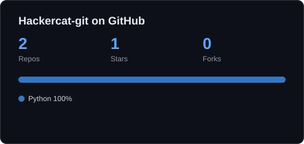

# 🐾 PurrFileGenerator

Genereer een strakke SVG-statistiekenkaart voor je GitHub-profiel: aantal repo's, sterren, forks en je meest gebruikte talen. Geen dependencies, alleen Python 3.8+.



## Gebruik

```bash
python purrfile.py <gebruikersnaam>
python purrfile.py <gebruikersnaam> -o kaart.svg --markdown
python purrfile.py <gebruikersnaam> --include-forks
```

Optioneel: zet een token om rate limits te vermijden.

```bash
export GITHUB_TOKEN=ghp_xxx      # macOS/Linux
$env:GITHUB_TOKEN="ghp_xxx"      # PowerShell
```

## Op je profiel tonen

1. Maak een repo met dezelfde naam als je gebruikersnaam (`Hackercat-git/Hackercat-git`).
2. Kopieer `purrfile.py` en `.github/workflows/update-card.yml` erheen.
3. Voeg in je profiel-README toe: ``
4. De GitHub Action ververst de kaart elke dag automatisch.

## Tests

```bash
python -m unittest discover tests
```

## Licentie

MIT
